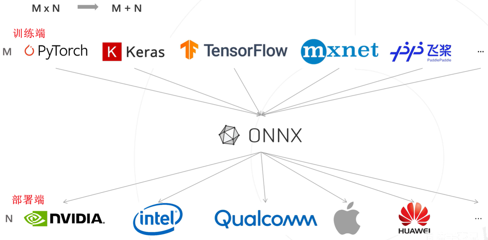
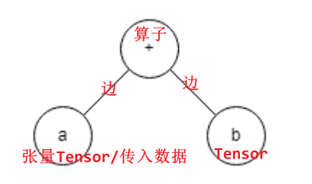

# Model Deployment

- [Model Deployment](#model-deployment)
  - [Introduction](#introduction)
  - [ONNX](#onnx)
    - [Delve into](#delve-into)
  - [ONNX Runtime](#onnx-runtime)
    - [本地终端部署推理](#本地终端部署推理)
    - [安卓手机部署推理](#安卓手机部署推理)
  - [LiteRT](#litert)
    - [Intro](#intro)
    - [ONNX + ONNX Runtime vs. LiteRT](#onnx--onnx-runtime-vs-litert)
    - [实践](#实践)

## Introduction

人工智能模型部署应用场景：
* 设备：pc, 手机, 服务器, 微信小程序, 嵌入式开发板, 树莓派, 无人机, 物联网设备等
* 特性：本地终端、快速实时、数据隐私、硬件多样化、但算力薄弱

**深度学习模型部署通用流程：**
1. 模型训练
   1. based on training frameworks such as PyTorch, TensorFlow, paddlepaddle, etc.
2. 模型转换为**中间表示**(intermediate representation, IR)
   1. e.g., **ONNX**, **tensorflow Lite (i.e., `.tflite`file)**, Qualcomm DLC, 作为中间桥梁
      1. 说`.onnx`是中间桥梁没啥毛病（跨框架的通用标准），但`.tflite`严格来说是TensorFlow生态内部的一种中间表示，Qualcomm DLC也类似吧。
   2. 其中ONNX极大地降低了部署的复杂度，统一了表示深度学习模型的标准；打破了不同训练框架之间的壁垒
3. 模型部署到不同目标硬件平台
   1. 将中间表示的模型部署到具体的硬件平台(e.g., NVIDIA, Qualcomm, Apple..)； 
   2. 硬件厂商会提供专门的推理引擎或运行时(Runtime)，如通用的ONNX Runtime，google的**LiteRT**, NVIDIA的TensorRT，Intel的OpenVINO, Tencent的NCNN, Alibaba的**MNN**...

> 之所以探索出这样一条路径：1. 配置和依赖环境不适合在手机、开发板等生产环境中安装； 2. DL模型比较庞大，需要庞大的算力，也即运行效率需要优化。

  
> training framework -> ONNX - inference framework

---

补充部署架构的三种常见模式：

| 项目           | 纯云端（Cloud-only）            | 云端 + SDK（半端侧, Hybrid） | 纯端侧（on-device）       |
| -------------- | ----------------- | -------------------- | -------------------- |
| 网络依赖       | 强                | 中等                 | 无                   |
| 隐私保护       | 弱                | 一般                 | 强                   |
| 推理速度       | 慢（依赖网络）    | 中                   | 快（本地）           |
| 模型大小限制   | 无限制            | 有限制               | 有严格限制           |
| 使用门槛       | 简单              | 简单                 | 高（需量化/压缩等）  |
| 应用场景和原因 | 大模型、高算力场景，适合复杂任务 | 需要兼顾算力和接入便捷，常用于语音识别、OCR等 | 隐私敏感和实时响应要求高，如语音助手、AR、人脸解锁 |

---
## ONNX

ONNX: Open Neural Network Exchange
* ONNX是一个开源的深度学习框架中间表示（IR）标准。
* 由微软、Facebook和亚马逊等公司在2017年共同开发的开源项目。
* 兼容各种深度学习框架、推理引擎、终端硬件、操作系统

> visualization of ONNX model: https://netron.app/


PyTorch to ONNX (`.pth -> .onnx`)

```python
# Load a pre-trained model (or you can load your own trained model)
model = models.resnet18(pretrained=True)
# Set the model to evaluation mode
model.eval()  # Ensure the model behaves correctly during inference/export/validation
# Create a dummy input tensor with the appropriate shape
dummy_input = torch.randn(1, 3, 224, 224)
# Export the model to ONNX format
torch.onnx.export(
    model,                       # The model to be converted
    dummy_input,                 # Any input set for the model
    'resnet18_imagenet.onnx',    # The exported ONNX filename
    opset_version=11,            # ONNX operator set version (ONNX has more than a dozen operator sets)
    input_names=['input'],       # Names of the input Tensors
    output_names=['output']      # Names of the output Tensors
)
```


相关资源(TODO)
* 模型部署入门教程（一）：模型部署简介 [link](https://zhuanlan.zhihu.com/p/477743341)
* 模型部署入门教程（二）：解决模型部署中的难题 [link](https://zhuanlan.zhihu.com/p/479290520)
* 模型部署入门教程（三）：PyTorch 转 ONNX 详解 [link](https://zhuanlan.zhihu.com/p/498425043)

### Delve into

> reference: [link](https://zhuanlan.zhihu.com/p/477743341)

* 首先神经网络的本质是描述了数据计算的过程，其结构可以用**计算图**表示。（as shown below）
* 为了加速计算，一些框架会使用对神经网络“**先编译，后执行**”的**静态图**来描述网络
* ==**计算图结构**== = ==节点(**算子**operator)== + 边(张量的数据流) + 拓扑结构(连接关系)
  * 算子：定义了做什么操作，e.g., Add, Conv, Relu, MaxPool, MatMul(矩阵乘法), etc.

  


静态图 vs. 动态图：

* **静态图**：先定义计算图，后执行计算图，即“先编译，后执行”。（e.g., TF early version, Caffe）
  * 性能好，但不灵活（难以表达复杂的控制流，e.g., if-else 分支语句和 for 循环语句）
  * **ONNX只用于表示更容易部署的静态图**
* **动态图**：每次执行计算图时，都会重新构建计算图，即“边定义，边执行”。（e.g., PyTorch, TF 2.0+）
  * 灵活，天然支持控制流语句，但性能稍逊

> 很像编译型语言和解释型语言的区别
---

Q: PyTorch 是动态图，而ONNX是静态图。那为什么PyTorch的模型能导出为 ONNX？ / `onnx.export()`为什么需要为模型提供一组输入呢？ / ONNX转换的原理(**tracing模型转换**)


A: 因为PyTorch在导出ONNX时，会将动态图“静态化”：即捕获一次前向执行的计算图结构，然后把它转化为静态图形式，从而兼容ONNX。

具体来说：PyTorch提供了一种叫做**追踪tracing**的模型转换方法。为模型提供一组输入`dummy_input`，运行一次模型的forward Propagation。这就可以记录本次前向传播用到的**计算图结构**/算子。

缺陷：只记录一次路径（静态），控制流等分支语句会被“定死”。如果模型中有 if-else 或 for 是基于输入值变化的逻辑，就只会记录当时走过的路径，别的路径不会导出。
可以通过编译为`TorchScript`来解决该问题(**Scripting**)，尝试解析Python代码中的控制流，转为静态的等价表达。


TODO


## ONNX Runtime

### 本地终端部署推理

just two steps to deploy ONNX model on local PC:

1. Install ONNX Runtime
2. Load ONNX model

```python
import onnxruntime as ort
# Load the ONNX model
ort_session = ort.InferenceSession("resnet18_imagenet.onnx")
img = preprocess_image("path_to_your_image.jpg")  # Preprocess your input image (e.g., resize, normalize, etc.)
# Run inference
outputs = ort_session.run(
    ['output'],
    {"input": img}  # Input name must match the one used during export
)[0] 
```

> 同样，你可以推理视频，或者推理摄像头实时视频流

==**PyTorch原模型推理(`.pth`) vs. ONNX Runtime推理(`.onnx`)**==

* 依赖环境不同：前者需要安装PyTorch，后者只需要安装ONNX Runtime
* 前者需要手动构造model, 加载weights，后者已经将模型和权重打包到`.onnx`文件中
* 前者适合开发与训练，后者适合跨平台的部署与推理
* 后者**速度**快个4-5倍吧（大约，决定因素很多了当然），然后**效果**理论上没有降低（实际上可能有细微微差别）


> 为什么ONNX Runtime推理速度更快？快个7-10倍。


### 安卓手机部署推理

调用安卓手机自身摄像头与计算资源，实时实现推理。

1. 将PyTorch训练的模型，转换为ONNX格式
2. 构建Android项目，添加ONNX Runtime-Android依赖
3. 然后也就是写个Android应用demo，加载ONNX模型，调用摄像头实时推理即可
   1. 将onnx模型和类别文件放在一定目录下
4. 构建并导出 APK 安装包，安装到安卓设备上运行

> 示例demo项目：[link](https://github.com/microsoft/onnxruntime-inference-examples/tree/main/mobile/examples/image_classification/android)

## LiteRT

### Intro

LiteRT (short for **Lite Runtime**, is the new name for **TensorFlow Lite** (TFLite)): 是google推出的面向设备端AI的高性能**运行时**(runtime)。 
> 奇怪的翻译? 其实就是运行模型的工具/模型推理引擎。


特性：

* 针对设备端侧机器学习(**On-Device Machine Learning, ODML**)进行了优化解决了五项**ODML constrains**:
  * 时延latency: 本地推理，不将数据回传到云端，故而无需往返服务器时延
  * 隐私Privacy: 本地推理，数据不离开设备
  * 网络依赖Connectivity: 必须在离线下正常运行
  * 体积Size: 缩减了model和binary的大小
  * 功耗Power Consumption: 低功耗运行，适合移动设备
* 多平台支持: android, iOS, embeded Linux, etc.
* 多训练框架支持：TensorFlow, PyTorch, JAX, Keras, etc. 由AI Edge的工具将上述模型转换为FlatBuffers格式(i.e., `.tflite` file)。
  * 原本是为了TensorFlow原生的，现在支持了更多框架


> LiteRT, part of the [Google AI Edge](https://ai.google.dev/edge) suite of tools, is the runtime that lets you seamlessly deploy ML and AI models on Android, iOS, and embedded devices. 

### ONNX + ONNX Runtime vs. LiteRT

大概是两条技术路线吧：

ONNX + ONNX Runtime: PyTorch/TensorFlow/.. -> `.onnx` file -> ONNX Runtime

LiteRT: PyTorch/TensorFlow/.. -> `.tflite` file -> LiteRT

核心区别：

* ONNX + ONNX Runtime: 通用与灵活
  * 可以理解为type-C充电口 + 万能充电器
* LiteRT: 专用与高效

* 生态
  * onnx: **开放标准**，由微软、Facebook和亚马逊等公司共同推动，促进不同框架与硬件之间的自由流通。
  * TFLite: Google亲儿子。主要围绕Tensorflow，主攻移动设别(尤其是Android)和嵌入式设备。

### 实践

