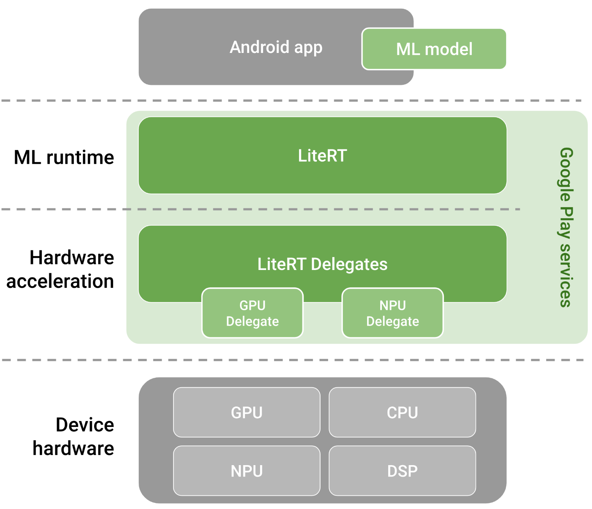
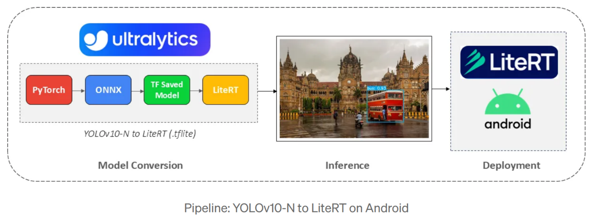
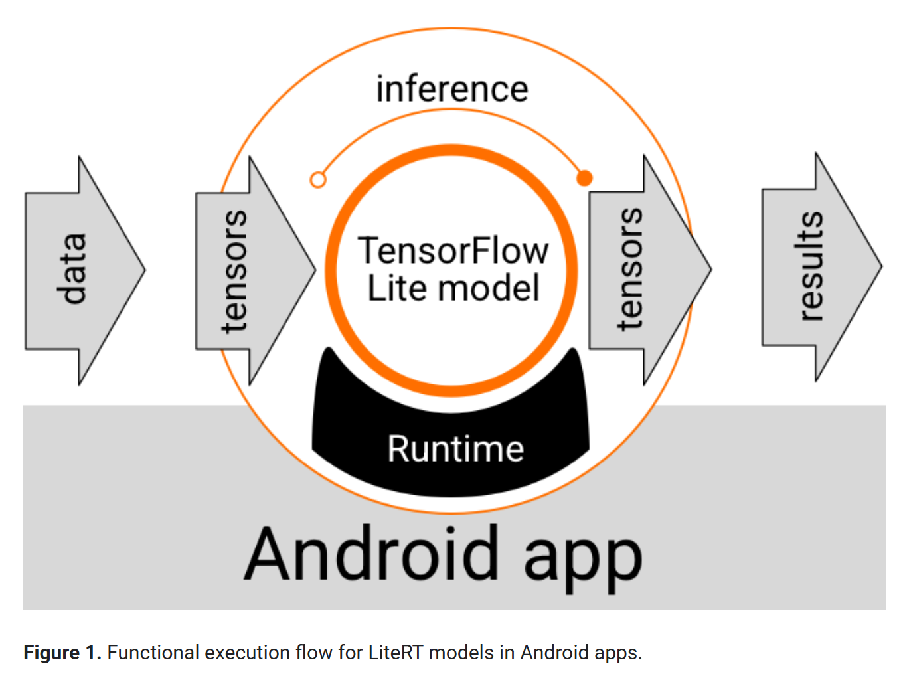

# LiteRT practice

- [LiteRT practice](#litert-practice)
    - [PyTorch to LiteRT](#pytorch-to-litert)
      - [Details](#details)
    - [Convert generative PyTorch models to LiteRT](#convert-generative-pytorch-models-to-litert)
  - [Run LiteRT model on Android](#run-litert-model-on-android)
  - [LiteRT-LM](#litert-lm)
    - [`.tflite` vs. `.litertlm`](#tflite-vs-litertlm)


1. AI Edge 提供了一些工具，可以将Tensorflow, PyTorch, JAX模型转换为
   LiteRT支持的FlatBuffers格式（`.tflite` file）。
2. Android常见部署模型
   1. 图像分类/目标检测: MobileNetV1/V2/V3, EfficientNet-lite, YOLOv5-nano, etc.
   2. LLM: qwen3, gemma-3, gemma3n, etc.

---

1. select a model
   1. use an existing LiteRT model: [link](https://www.kaggle.com/models?framework=tfLite)
   2. convert a model into a LiteRT model

  


  


### PyTorch to LiteRT

AI Edge Model Conversion and Inference Demo

This example demonstrates how to:
- Load a pretrained ResNet18 model
- Preprocess an input image
- Run inference using the original PyTorch model
- Convert the model to AI Edge (TFLite) format using `ai_edge_torch`
- Run inference with the converted model
- Compare the results
- Export the model as a `.tflite` file

```python
# *step 0: Import required libraries
import ai_edge_torch              # AI Edge conversion toolkit
import torch             
import numpy                   
import torchvision               # Pretrained vision models and transforms
from PIL import Image

# *step 1: load a pretrained model
# Load a pretrained ResNet18 model from torchvision
# The 'weights' argument is the recommended modern approach (instead of pretrained=True)
model = torchvision.models.resnet18(
    weights=torchvision.models.ResNet18_Weights.IMAGENET1K_V1
).eval()

# *step 2: Prepare Sample Input
sample_input = (torch.randn(1, 3, 224, 224),)

# *step 3: Load and Preprocess an Actual Image (optional)
img_path = "test.png"
input_image = Image.open(img_path).convert("RGB")
# Define image preprocessing pipeline
transform = torchvision.transforms.Compose([
    torchvision.transforms.Resize((224, 224)),
    torchvision.transforms.ToTensor(),
    torchvision.transforms.Normalize(
        mean=[0.485, 0.456, 0.406], 
        std=[0.229, 0.224, 0.225]
    ),
])
# Apply transformation and add batch dimension
img_tensor = transform(input_image).unsqueeze(0)

# *step 4: Inference with the Original PyTorch Model
with torch.no_grad():
    output_pt = model(img_tensor)
    probs_pt = torch.nn.functional.softmax(output_pt, dim=1)
# Get predicted class and probability
pred_class_pt = torch.argmax(probs_pt).item()
print(f"Predicted class: {pred_class_pt} and the probability is {probs_pt[0][pred_class_pt].item()}")

# *step 5: Convert the Model to AI Edge (TFLite) Format
edge_model = ai_edge_torch.convert(model.eval(), sample_input)

# *step 6: Inference with the Converted Model
output_lite = edge_model(img_tensor)
from scipy.special import softmax
probs_lite = softmax(output_lite, axis=1)
pred_class_lite = numpy.argmax(probs_lite).item()
print(f"Predicted class from edge model: {pred_class_lite} and the probability is {probs_lite[0][pred_class_lite]}")

# *step 7: Compare Results
if numpy.allclose(
    output_pt.detach().numpy(),
    output_lite,
    atol=1e-5,  # Absolute tolerance
    rtol=1e-5   # Relative tolerance
):
    print("Inference result with PyTorch and TFLite was within tolerance")
else:
    print("Something wrong with PyTorch → TFLite conversion")

# *step 8: Export the Model as a .tflite File
edge_model.export('resnet.tflite') # about 45MB
```

> 部署后有关签名、量化的步骤参考：[link](https://github.com/google-ai-edge/ai-edge-torch/blob/main/docs/pytorch_converter/README.md#use-odml-torch-conversion-backend-experimental)

---

#### Details

第一层：

1. `ai_edge_torch.conver()`转换过程中需要sample inputs来进行**tracing模型转换**（以tuple形式传入）（和ONNX转换原理类似，参考`deployment.md`）
   1. tracing是一种模型转换方法：提供一个input，运行一次forward propagation，记录下本次传播用到的的计算图。
   2. if the PyTorch model receives 3 tensors as positional arguments, the `convert` function receives 1 tuple with 3 entries.
   3. convert expects a `torch.nn.Module` with a `forward function` that receives tensors as arguments and returns tensors as outputs

第二层：
`ai_edge_torch.convert()`API具体转换过程：

1. 模型导出：使用PyTorch2.x的`torch.export()`功能，追踪模型并生成一个中间表示（FX图）（ref: [link](https://developers.googleblog.com/en/ai-edge-torch-high-performance-inference-of-pytorch-models-on-mobile-devices/)
   1. `torch.export()`是TorchDynamo和TorchScript的演进版，可以将PyTorch模型导出为**中间表示**，导出模型用于部署和优化
2. 优化和转换：AI Edge Torch应用编译器优化，比如操作融合(op fusion)和constant folding，以提升性能。优化便可后将中间便是转换为tflite格式文件。即可用于LiteRT和MediaTask
3. > 对于llm或transformer-based model可能涉及额外的步骤(如量化，什么KV Cache优化等等)

---

此外，还有很多模型转换为LiteRT/`.tflite`的方法，比如(仅供了解)：

* ultralytics公司(YOLO的公司吧)的`ultralytics`包同样可以一行代码将YOLO model从torch转换为LiteRT格式: [link](https://medium.com/google-developer-experts/yolov10-to-litert-object-detection-on-android-with-google-ai-edge-2d0de5619e71)
  * PyTorch -> ONNX Graph -> TensorFlow SavedModel -> LiteRT
* Datature训练平台/公司可以自动导出为.tflite格式: [link](https://datature.io/blog/how-to-use-litert-for-real-time-inferencing-on-android)

### Convert generative PyTorch models to LiteRT

> reference:
> https://ai.google.dev/edge/litert/models/edge_generative?authuser=1
> https://github.com/google-ai-edge/ai-edge-torch/tree/main/ai_edge_torch/generative

* AI Edge Torch Generative API是一个针对移动设备优化的library，用于将transformer-based PyTorch models转为LiteRT格式，支持在设备上进行图像和文本生成。（eg Gemma, TinyLlama, qwen...）
* 目前仅支持CPU，并计划支持GPU和NPU。
* now is an *early developer preview*

TO BE CONTINUED...


---

[reference](https://github.com/google-ai-edge/ai-edge-torch/tree/main/ai_edge_torch/generative#model-authoring-using-edge-generative-api)

1. 你可以自选一个任意的训练好的PyTorch模型，可以来自hugginface, kaggle...
2. 使用[example](https://github.com/google-ai-edge/ai-edge-torch/blob/main/ai_edge_torch/generative/examples/README.md)中有了的模型，或者自己基于Edge Generative API去[re-author](https://github.com/google-ai-edge/ai-edge-torch/tree/main/ai_edge_torch/generative#model-authoring-using-edge-generative-api)一个模型...
3. 使用库中提供的Quantization API来量化模型，以减小size和提升性能
4. 使用模型评估管道验证模型实现和质量
5. 将PyTorch LLM转为`.tflite`格式
6. 设备端测部署

---


## Run LiteRT model on Android

1. choose a prebuilt liteRT model from [link](https://ai.google.dev/edge/litert/models/trained?authuser=1)
2. convert other models to LiteRT format using AI Edge Torch

  

Android应用需要具备：
* LiteRT runtime environment for executing the model
  * LiteRT in **Google Play services runtime environment**
* Model input hander to transform data into tensors
* Model output handler to **receive** output result tensors and **interpret** them as predictions results

## LiteRT-LM

A C++ library to efficiently run language models across edge platforms.

> c++可以最大限度地榨取硬件性能，减少资源占用；可以精细控制系统底层、内存布局和执行流程；高度可移植，去目标平台重新编译即可运行。

LiteRT-LM提供的model是`.litertlm`格式

### `.tflite` vs. `.litertlm`

* `.tflite`是Google LiteRT使用的**通用**机器学习模型格式，包含模型执行图和可选的元数据。是FlatBuffer格式
  * 可以通过AI Edge Torch工具将PyTorch模型转换为`.tflite`格式，适合一般ML模型。当然还支持Tensorflow, JAX等框架
* `.litertlm`是LiteRT-LM项目**专为语言模型**设计的格式（**可能是**`.task`文件(MediaPipe GenAI Tasks使用)的演进版本，包含.tflite模型、分词器和其他必要组件
  * 不可直接转换，需要先用AI Edge Torch Generative API将PyTorch模型转换为.tflite，然后**可能通过**LiteRT-LM或MediaPipe的工具打包为.litertlm格式（等待LiteRT-LM跟新吧...


