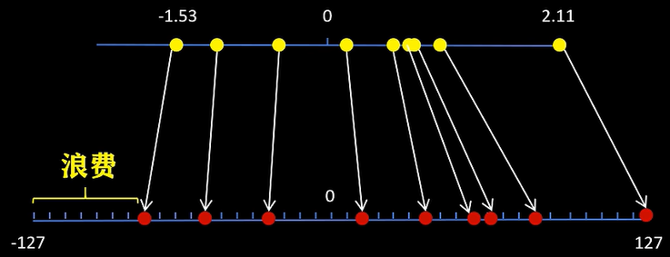
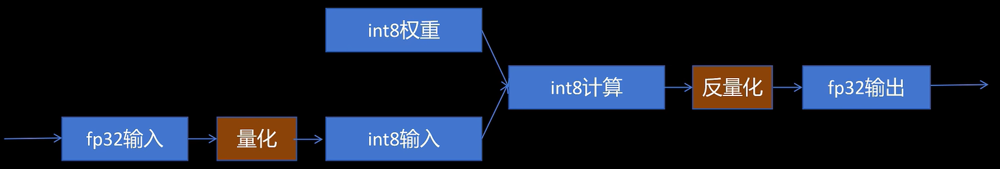
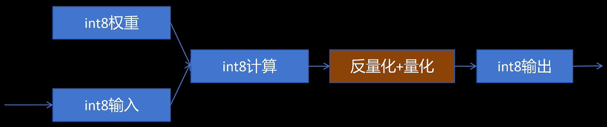
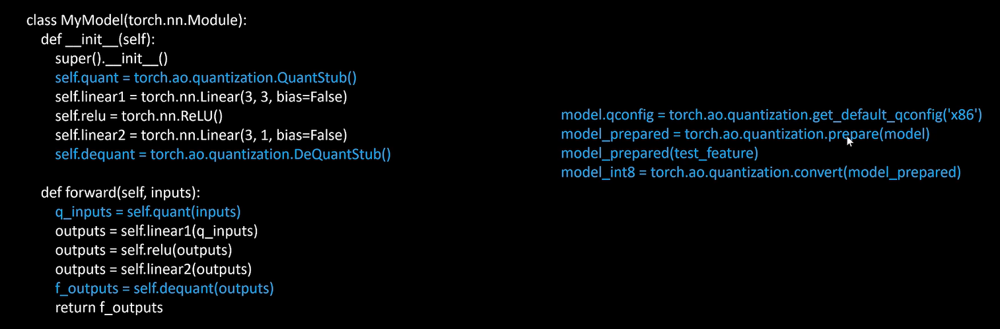
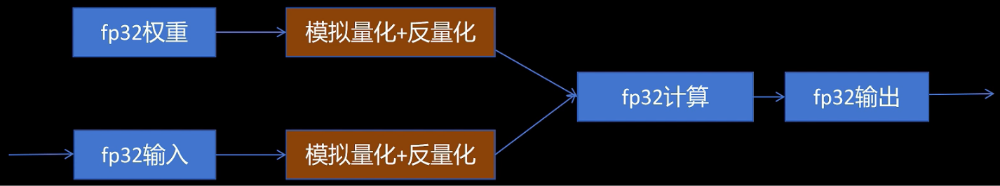

# Quantization

- [Quantization](#quantization)
  - [Intro](#intro)
  - [量化技术简介](#量化技术简介)
    - [常见数据类型](#常见数据类型)
    - [对称量化 (symmetric quantization)](#对称量化-symmetric-quantization)
    - [非对称量化 (asymmetric quantization)](#非对称量化-asymmetric-quantization)
    - [取值范围的映射与裁剪](#取值范围的映射与裁剪)
  - [神经网络量化](#神经网络量化)
    - [训练后量化 Post-Training Quantization (PTQ)](#训练后量化-post-training-quantization-ptq)
      - [训练后动态量化](#训练后动态量化)
      - [训练后静态量化](#训练后静态量化)
    - [量化感知训练 Quantization Aware Training（QAT）](#量化感知训练-quantization-aware-trainingqat)
    - [Other](#other)


> Reference:
> * A Visual Guide to Quantization：[English](https://newsletter.maartengrootendorst.com/p/a-visual-guide-to-quantization), [Chinese](https://mp.weixin.qq.com/s/dgS-yRVpGe_w1uzbcVctXg)
> * [Related video series from Bilibili](https://www.bilibili.com/video/BV1EE42157Ms/?spm_id_from=333.337.search-card.all.click&vd_source=31f382886b368673a25ce3ff23e82bfc) 

## Intro


**基础概念：**

* `.pt`是PyTorch保存模型的文件格式，通常包含**模型结构**（可选）和模型参数（**权重**、**偏置**等），但不包含**激活值**。
* **权重weights**: 是神经网络中每个连接的“**乘法系数**”，是模型训练时学习得到的核心参数，用于输入和输出之间的变换。e.g., 卷积核、全连接层矩阵中的元素。
* **偏置biases**: 是加在加权求和结果上的**常数项**，用来增强模型的表达能力，是训练过程中学习到的参数。类似线性公式`y = Wx + b`中的b。
* **激活值activations**: 是神经网络中**每层输出的中间结果**，依赖于具体输入数据，在**模型运行（推理或训练）时动态计算**，不保存在.pt中。e.g., 例子：ReLU, sigmoid, Softmax等操作后的结果。
  * **input** tensor也可以算做是NN的第一层activations，和其它层一样(虽然activations一般指NN的output)

---

* LLMs中，weights和biases在运行模型之前已训练好，确定了，作为静态参数存在模型中
* LLM通常包含数十亿个参数，**几乎全部来自weights**(即weights远大于biases), 故量化主要针对weights


**什么是量化？**

将float类型(e.g., FP32, FP16)的模型参数和激活值，用整数(e.g., INT8, INT4)来代替，同时尽可能地减少量化后模型推理的误差。


**为什么要进行模型量化？**

1. **存储开销**，加载模型就需要占用大量内存
   1. e.g., Llama 13B在FP32下需要52GB显存，在FP16下需要26GB显存，在INT8下需要13GB显存，在INT4下需要6.5GB显存
2. 模型推理时，激活值activations是input和weights计算而来，更低的精度可以**减少计算量**，提升推理速度
   1. e.g., A100 GPU对FP16的算力是FP32的2倍，对INT8的算力是FP16的2倍
3. 模型推理计算过程中TensorCore和显存之间需要进行频繁的数据交换；模型量化后，传输的数据量变小，**数据IO**速度更快


**为什么还要考虑反量化？**

* 比如你将一个float32量化到int8(如[-128,127])，计算得到量化结果后你最终肯定还是要通过反量化表示回float32的，因为功能上我们还是要用float32的值吧。
* 量化只是为了得到上述三个好处，同时反量化后尽可能地和未量化得结果相近。

> 其实也就是数据压缩和解压恢复。跟autoencoder的encoder和decoder很像了

---

**Other Basis**:

1. 参数的数值value一般是由float浮点数的形式表示，一般根据IEEE754的规则可以使用一系列bits来表示float value
   1. IEEE754: eg float16: 符号位sign 1bit + 指数部分exponent 5bits + 小数部分/尾数significand 10bits
   2. 用于表示value的bits越多，表示的数值**动态范围**越大(dynamic range是指一个特定的数值表示法所能表示的所有数值的区间)，精度(precision是指相邻两个数字之间的**间隔**)越高
      1. 其中exponent决定range，significand决定precision
2. 故而我们想要减少表示模型参数的bits数量，但精度降低往往影响模型准确率。模型量化就是要减少bits，同时不损害模型准确率

## 量化技术简介

### 常见数据类型

* FP32: 32bits: sign 1 bit + exponent 8 bits + significand 23 bits
* FP16: 16 bits / 半精度: sign 1 bit + exponent 5 bits + significand 10 bits
  * 由于FP16的exponent只有5bits，所以range小很多，为了保持于FP32相似的range，引入了bfloat16类型
* BF16: 16 bits: sign 1 bit + exponent 8 bits + significand 7 bits
  * 相比FP32, range相似，截断了significand。也即**范围相似，bits减半**
* INT8: 8 bits: 整数类型，范围[-128, 127]，精度1。（注意不同量化方法会选择不同范围，eg [-127,127]）
  * 如何将FP32的value mapping 到INT8?
    * 对称量化 symmetric quantization, 非对称量化 asymmetric quantization；二者都属于**Linear mapping**
* INT4: 4 bits: 整数类型，范围[-8, 7]，精度1

### 对称量化 (symmetric quantization)

原本浮点数的值域会被映射到量化空间（quantized space）中一个以零为中心的对称区间

> 目标：mapping的结果占满区间[-127, 127]
> 问题：某一侧范围被浪费 -> 非对称量化


  


经典实现算法之一：
**绝对最大值量化**：找到原始数据的最大绝对值，将其作为量化的范围。然后将原始数据映射到[-127, 127]范围内。

$$
\text{scale} = \frac{127}{\max(|x|)} \\
X_{quantized} = \text{round}(x \times \text{scale})
$$

即：该量化方法就是一个linear mapping，再套个round function。要想**反量化**(dequantize)直接除一下反向mapping即可。
> 但是dequantize后的值未必可以完全恢复原始值，因为round会导致精度损失。dequantize - original = quantization error(**量化误差**)

### 非对称量化 (asymmetric quantization)

并非以零为中心对称(即存在**零点偏移**)，而是将原始数据范围的min_val和max_val mapping到量化范围的min_val和max_val。计算稍微复杂点，结果精度更高。

> 比如对于INT8，使用[-128,127]，也可以用[0,255]

计算公示如下：
$$
\text{scale} = \frac{255}{max(x) - min(x)} \\
\text{zero\_point} = Round(-min(x) \times \text{scale}) - 128 \\
X_{quantized} = \text{round}(x \times \text{scale} + \text{zero\_point})
$$

> 即需要计算INT8范围内的零点来调整结果

### 取值范围的映射与裁剪

如果原数值中一个value远大于其他数值，即outlier，可能会导致量化后其他数值的精度损失。为了解决这个问题，可以对原始数据进行裁剪(clipping)，比如只mapping原数据中[-5,5]之间的数据，超出该范围的直接映射到量化空间空间的两个边界点。

> 上述选取[-5,5]的这个过程叫做校准Calibration

校准的目的是找到一个范围，能**尽可能多地包含values**，同时**尽量减少量化误差**。


## 神经网络量化

* 原则：量化是对每一层而言，每一层进行量化计算，每一层输出时对结果**反量化**，下一层再进行量化和反量化...
* 为什么量化对神经网络结果影响不大？
  * 一般输入和权重都经过了normalization，基本数据范围变化不大
  * 激活函数本身会平滑这个影响
  * 神经网络本身具有鲁棒性，可以容忍一定程度的噪声和误差

### 训练后量化 Post-Training Quantization (PTQ)

PTQ是指在训练完模型后对模型的参数（包括weights和activations）进行量化

* 权重：量化可以采用对称量化和非对称量化
* 激活值：由于我们**不知道**，因此需要通过模型的推理来获取它们的potential distribution，然后再进行量化。激活值的量化有两种方式：**动态量化**和**静态量化**

#### 训练后动态量化

> 核心思想：数据通过NN隐藏层后，activations会被收集起来，得到一个distribution，进而统计得到**量化所需的零点和比例因子**，如此即可进行量化

**过程：**
1. 将训练好的模型weights转为int8，并保存量化参数
2. 推理时，**对每一层输入的fp32激活值，动态进行量化为int8**
   1. 原理如上
3. 在每一层对量化后的int8权重和int8激活值进行计算
4. 在每一层输出时将结果dequantize为fp32
5. 将fp32激活值传入下一层
6. ...

  

PyTorch API:

```python
# 对model的nn.Linear层进行qint8类型的量化
model_int8 = torch.ao.quantization.quantize_dynamic(model, {torch.nn.Linear}, dtype=torch.qint8)
```

**问题：**

1. **==每次推理==**，每一层都需要对输入的激活值计算distribution和统计参数值，太费劲了
2. 每一层计算完都需要转回fp32，并存入显存，浪费显存带宽

#### 训练后静态量化

> 核心思想：用有代表性的input tensor(校准数据集)跑一遍forward propagation，通过统计得到每层大概的量化参数。**此后的推理都不再实时计算统计参数**；故而静态量化损失了一定的精度，来换取高效推理

**过程：**

1. 将模型weights转为int8，并保存量化参数
2. 校准Calibration: 用有代表性的input tensor(校准数据集)跑一遍forward propagation，通过统计得到每层大概的量化参数
   1. 这就解决了上述问题一
   2. **此后的推理都不再实时计算统计参数**
3. 在每一层对量化后的int8权重和int8激活值进行计算
4. 在每一层输出时将结果dequantize为fp32，**同时根据校准产生的量化参数再将fp32激活值量化为int8**
   1. 这就解决了上述问题二
5. 将**int8**激活值传入下一层
6. ...

  

  

### 量化感知训练 Quantization Aware Training（QAT）

* PTQ的问题：对于训练好的model，无论怎么量化，都会有误差。故而可以考虑QAT
* 在网络训练过程中，插入模拟量化结点(fake_quantization)来分别对模型的参数和激活值进行量化和反量化，让模型在训练中就能调整参数，让其更适合量化，提高结果精度。

  

### Other


* 有关4-bit量化, 1bit量化, GPTQ, GGUF，参考[link](https://mp.weixin.qq.com/s/dgS-yRVpGe_w1uzbcVctXg)...
* 有关LLM.int8(), QLoRA，参考[link](https://www.bilibili.com/video/BV15y411a7so?spm_id_from=333.788.videopod.sections&vd_source=31f382886b368673a25ce3ff23e82bfc)
