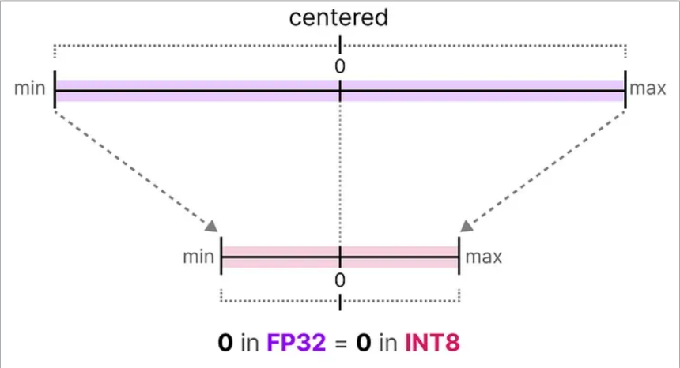

# Quantization

## Intro

1. LLM有数十亿参数参数，主要是权重参数weights，有多个问题：
   1. 存储开销，然后你加载模型就需要占用大量内存
   2. 模型推理时，激活值activations是input和weights计算而来，故而推理速度
2. 参数的数值value一般是由float浮点数的形式表示，一般根据IEEE754的规则可以使用一系列bits来表示float value
   1. IEEE754: eg float16: 符号位sign 1bit + 指数部分exponent 5bits + 小数部分/尾数significand 10bits
   2. 用于表示value的bits越多，表示的数值**动态范围**越大(dynamic range是指一个特定的数值表示法所能表示的所有数值的区间)，精度(precision是指相邻两个数字之间的**间隔**)越高
      1. 其中exponent决定range，significand决定precision
3. 故而我们想要减少表示模型参数的bits数量，但精度降低往往影响模型准确率。模型量化就是要减少bits，同时不损害模型准确率

## 量化技术简介

### 常见数据类型

* FP32: 32bits: sign 1 bit + exponent 8 bits + significand 23 bits
* FP16: 16 bits / 半精度: sign 1 bit + exponent 5 bits + significand 10 bits
  * 由于FP16的exponent只有5bits，所以range小很多，为了保持于FP32相似的range，引入了bfloat16类型
* BF16: 16 bits: sign 1 bit + exponent 8 bits + significand 7 bits
  * 相比FP32, range相似，截断了significand。也即**范围相似，bits减半**
* INT8: 8 bits: 整数类型，范围[-128, 127]，精度1。（注意不同量化方法会选择不同范围，eg [-127,127]）
  * 如何将FP32的value mapping 到INT8?
    * 对称量化 symmetric quantization, 非对称量化 asymmetric quantization；二者都属于**Linear mapping**

### symmetric quantization

原本浮点数的值域会被映射到量化空间（quantized space）中一个以零为中心的对称区间

  

具体实现算法之一：
绝对最大值量化：找到原始数据的最大绝对值，将其作为量化的范围。然后将原始数据映射到[-127, 127]范围内。

$$
\text{scale} = \frac{127}{\max(|x|)} \\
X_{quantized} = \text{round}(x \times \text{scale})
$$

即：该量化方法就是一个linear mapping，再套个round function。要想恢复(dequantize)直接除一下反向mapping即可。
> 但是dequantize后的值未必可以完全恢复原始值，因为round会导致精度损失。dequantize - original = quantization error(**量化误差**)

### asymmetric quantization

并非以零为中心对称(即存在**零点偏移**)，而是将原始数据范围的min_val和max_val mapping到量化范围的min_val和max_val

> 使用[-128,127]

计算公示如下：
$$
\text{scale} = \frac{128 - (-127)}{max(x) - min(x)} \\
\text{zero point} = Round(-min(x) \times \text{scale}) - 128 \\
X_{quantized} = \text{round}(x \times \text{scale} + \text{zero point})
$$

> 即需要计算INT8范围内的零点来调整结果

### 取值范围的映射与裁剪

如果原数值中一个value远大于其他数值，即outlier，可能会导致量化后其他数值的精度损失。为了解决这个问题，可以对原始数据进行裁剪(clipping)，比如只mapping原数据中[-5,5]之间的数据，超出该范围的直接映射到量化空间空间的两个边界点。

> 上述选取[-5,5]的这个过程叫做校准Calibration

### 校准过程 Calibration

校准的目的是找到一个范围，能**尽可能多地包含values**，同时**尽量减少量化误差**。

#### 权重weights & 偏置biases

LLMs中，weights和biases在运行模型之前就确定了，可以视为预先确定的静态值。其中，weights又远大于biases，故而量化主要关注weights的量化。

TO BE CONTINUED...